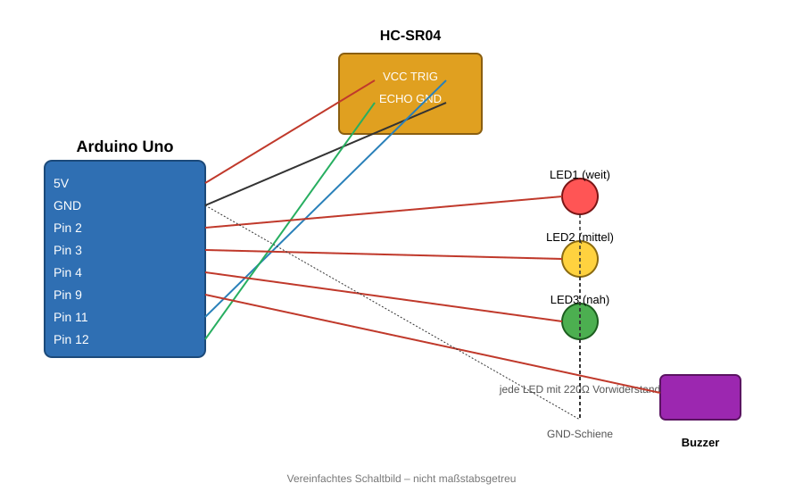

# HC-SR04 Distance Warner

Ein einfaches Arduino-Projekt: Ein HC-SR04 Ultraschallsensor misst die Entfernung zu einem Objekt und steuert je nach Nähe 3 LEDs sowie einen aktiven Buzzer an.

## Funktionsweise

| Entfernung        | Verhalten                  |
|--------------------|-----------------------------|
| > 50 cm            | LED1 leuchtet (weit weg)   |
| 25 – 50 cm         | LED2 leuchtet (mittel)     |
| < 25 cm            | LED3 leuchtet + Buzzer piept (nah) |

Die Schwellenwerte lassen sich im Code über die Konstanten `schwelleWeit` und `schwelleMittel` anpassen.

## Bauteile

- Arduino Uno
- HC-SR04 Ultraschallsensor
- 3x LED (z. B. rot, gelb, grün)
- 3x Vorwiderstand 220 Ω
- 1x aktiver Buzzer
- Breadboard + Jumperkabel

## Pinbelegung

| Bauteil          | Arduino Pin |
|-------------------|-------------|
| HC-SR04 VCC       | 5V          |
| HC-SR04 GND       | GND         |
| HC-SR04 TRIG      | Pin 11      |
| HC-SR04 ECHO      | Pin 12      |
| LED1 (weit)       | Pin 2       |
| LED2 (mittel)     | Pin 3       |
| LED3 (nah)        | Pin 4       |
| Buzzer            | Pin 9       |

## Schaltplan

Jede LED wird über einen 220 Ω Vorwiderstand betrieben (Position des Widerstands vor oder nach der LED ist elektrisch egal). Wichtig ist nur die Ausrichtung der LED: langes Bein (Anode) Richtung Arduino-Pin, kurzes Bein (Kathode) Richtung GND.

## Code

Siehe [`distance_warner.ino`](distance_warner.ino).

## Wichtiger Hinweis zum Buzzer

Der Buzzer-Pin wird im `setup()` sofort auf `LOW` gesetzt. Das verhindert, dass der Pin beim Start "floatet" und der aktive Buzzer fälschlicherweise einen Dauerton erzeugt.

## Setup

1. Schaltung gemäß Schaltplan/Pinbelegung aufbauen
2. `distance_warner.ino` in der Arduino IDE öffnen
3. Board (Arduino Uno) und Port auswählen
4. Hochladen
5. Seriellen Monitor mit 9600 Baud öffnen, um die gemessene Entfernung live zu sehen
